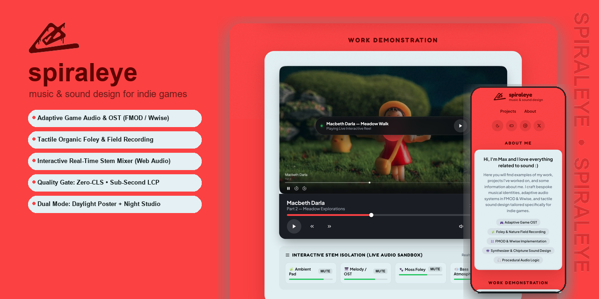

<div align="center">

  

  <br><br>

  <h1>spiraleye — music & sound design</h1>

  <p>
    <strong>Auteur portfolio &amp; interactive sound design showcase for indie games.</strong><br>
    Crafted with tactile fluid physics, deckle-edge clay cards, and a real-time Web Audio API stem mixer.
  </p>

  <p>
    <a href="https://github.com/Djoystick/Spiraleye"></a>
    <a href="https://github.com/Djoystick/Spiraleye"></a>
    <a href="https://github.com/Djoystick/Spiraleye"></a>
    <a href="https://github.com/Djoystick/Spiraleye"></a>
    <a href="https://github.com/Djoystick/Spiraleye"></a>
  </p>

</div>

---

## 🎨 1. Concept & Visual Identity

**Spiraleye** moves away from generic dark corporate portfolio templates. It is built as a vibrant, artisanal **Cinnabar Poster with Deckle-Edge Clay Cutout Cards**, inspired by stop-motion games and zine aesthetics (*Sayonara Wild Hearts*, *Chicory*, *Amanita Design*, *Pikuniku*).

* **Daylight Poster Mode (Default Figma Palette):**
  * Canvas: Warm Poppy Cinnabar Red (`#FB4142`)
  * Side Rails: Tone-on-tone vertical watermark running columns (`#D3191A`)
  * Content Cards: Handcrafted Pale Ice-Clay (`#E2EFF3`) with organic contour and diffused warm shadows
  * Ink Typography: Deep Burgundy / Marsala (`#5E0402`) & Slate (`#11191B`)
* **Night Studio Mode (Tape Dark Theme):**
  * Instant toggle for late-night audio mastering sessions
  * Canvas shifts to deep studio charcoal (`#0E0F12`) with dark clay containers and glowing cinnabar indicators
  * Zero-Flash instantaneous hydration via synchronous script in `<head>`

---

## 🎛️ 2. Interactive Audio Features

Rather than static mockups or heavy 30MB downloads, the portfolio embeds a high-performance **Web Audio API procedural sound engine**:

* **Procedural Indie-Game Soundscape:**
  * Harmonic progression with warm analog pads, playful kalimba arpeggios, organic moss foley, and deep sub-bass.
* **Live 4-Track Stem Isolation Sandbox:**
  * Allows game directors to isolate and audition stems in real time:
    1. 🌿 **Ambient Pad** (Atmosphere & space)
    2. 🎹 **Melody / OST** (Upright piano & kalimba leads)
    3. 🐾 **Moss Foley** (Organic footsteps & environment)
    4. 🔊 **Bass Atmosphere** (Harmonic foundation)
* **Oscilloscope Waveform Canvas:**
  * Real-time frequency response visualization rendered over the *Macbeth Darla* showreel.
* **Persistent Bottom Audio Dock:**
  * Uninterrupted playback across page scrolling with animated pulse status.

---

## ⚡ 3. Quality Gate & Engineering Standards

Tested automatically via Puppeteer Core in [`scripts/test-harness.js`](scripts/test-harness.js):

| Audit Metric | Target Threshold | Measured Result | Status |
| :--- | :--- | :--- | :--- |
| **LCP (Largest Contentful Paint)** | `< 1200 ms` | **844 ms** | ✅ PASSED |
| **CLS (Cumulative Layout Shift)** | `< 0.0200` | **0.0058 (Zero-CLS)** | ✅ PASSED |
| **DCL (DOMContentLoaded)** | `< 800 ms` | **695 ms** | ✅ PASSED |
| **TTFB (Time to First Byte)** | `< 300 ms` | **14 ms** | ✅ PASSED |
| **Console Errors** | `0 errors` | **0 errors** | ✅ PASSED |
| **Mobile 375px Viewport** | No overflow (`overflow-x: clip;`) | **375px <= 375px** | ✅ PASSED |
| **Touch Ergonomics** | Apple/Google 44×44px standards | **Compliant** | ✅ PASSED |
| **Microdata & SEO** | OpenGraph + Schema.org JSON-LD | **100% Validated** | ✅ PASSED |

---

## 🖐️ 4. Tactility & Fluid Motion (Apple WWDC Standards)

* **Zero-Latency Press:** Buttons compress instantly (`scale(0.965)`) in 40ms on `pointerdown` without waiting for the delayed click event.
* **Damping Physics:** Critical spring damping `damping: 1.0` by default — natural deceleration without rubbery oscillations.
* **DPR-Adaptive Film Grain:** Ultra-fine monochromatic noise overlay preventing color-banding across OLED and Retina displays.

---

## 📁 5. Repository Structure

```text
├── assets/
│   ├── logo_dripping_alpha.png   # Hand-drawn logo with paint drip (transparent)
│   ├── logo_clean_alpha.png      # Clean vector-traced glyph (transparent)
│   ├── showreel_macbeth_darla.jpg # Stop-motion game scene poster
│   └── social-preview.png        # High-res 1280x640 OpenGraph & GitHub preview
├── css/
│   └── styles.css                # Design tokens, clay deckle-edge masks, dark mode
├── js/
│   ├── audio-engine.js           # Procedural Web Audio API synthesizer & stem mixer
│   └── main.js                   # Player controller, visualizer & touch handlers
├── scripts/
│   ├── test-harness.js           # Automated Puppeteer Core Quality Gate runner
│   └── visual-regression.js      # Headless visual baseline regression suite
├── favicon.ico                   # Multi-resolution favicon
├── favicon.png                   # High-res PNG icon
├── index.html                    # Semantic HTML5 entry point
├── package.json                  # Dependencies & test scripts
├── CHANGELOG.md                  # Semantic version history (v1.0.0)
└── PROJECT_MEMORY.md             # Architecture decisions & design invariants
```

---

## 🚀 6. Getting Started

### Prerequisites
* [Node.js](https://nodejs.org/) v18+ (tested on Node v24)
* Modern web browser (Chrome, Edge, Safari, Firefox)

### Installation & Local Run
```bash
# Clone the repository
git clone https://github.com/Djoystick/Spiraleye.git
cd Spiraleye

# Install dev dependencies (Puppeteer Core & test runner)
npm install

# Start local preview server
npm start
```
Open [http://localhost:3000](http://localhost:3000) in your browser.

### Run Quality Gate Audit
```bash
npm run test:harness
```

---

## 📬 7. Contact & Collaboration

* **Composer & Sound Designer:** Max (Spiraleye)
* **Email:** [max@spiraleye.audio](mailto:max@spiraleye.audio)
* **Telegram:** [@spiraleye](https://t.me/Tri_chasa_nazad)
* **Discord:** `spiraleye#0001`
* **Specialization:** Adaptive OST, Foley, Interactive FMOD/Wwise Implementation for Indie Games

---

<div align="center">
  <sub>© 2026 Max (Spiraleye). Designed & engineered with pure passion for indie games.</sub>
</div>
